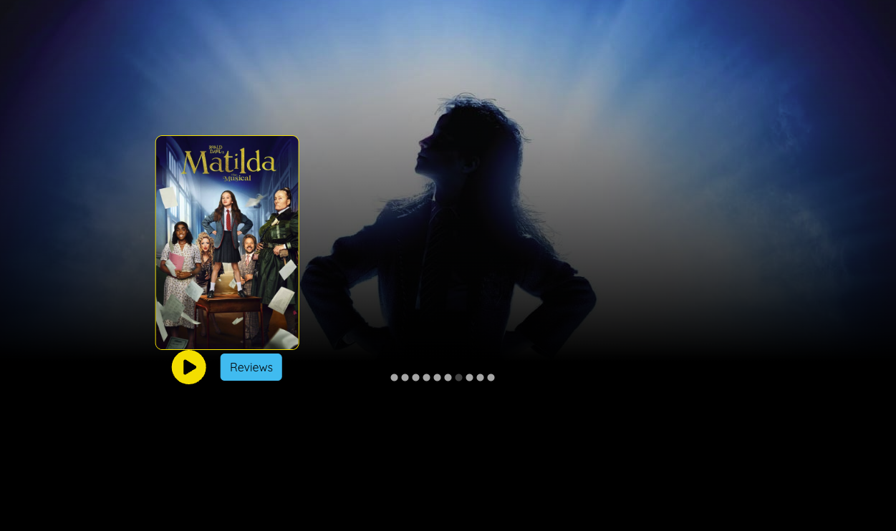
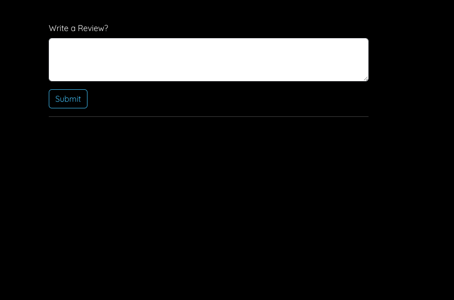

<!DOCTYPE html>
<html lang="en">
<head>
    <meta charset="UTF-8">
    <meta name="viewport" content="width=device-width, initial-scale=1.0">
</head>
<body>
    <h1>Movie Review</h1>
    
Full-Stack application for browsing movies, watching trailers, and submitting reviews. Built with Java (Spring Boot) for the backend, React for the frontend, and MongoDB for storing the movie and review data.

    <h2>Features</h2>
    <ul class="features">
        <li><strong>Movie Listing</strong>: Browse a list of movies with posters and basic information.</li>
        <li><strong>Movie Trailers</strong>: Watch trailers embedded in the app.</li>
        <li><strong>User Reviews</strong>: Submit and view movie reviews for each film.</li>
        <li><strong>Responsive UI</strong>: Optimized for both desktop and mobile devices.</li>
    </ul>
    <h2>Tech Stack</h2>
    <ul class="tech-stack">
        <li><strong>Backend</strong>: Java, Spring Boot</li>
        <li><strong>Frontend</strong>: React, HTML, CSS, Bootstrap</li>
        <li><strong>Database</strong>: MongoDB</li>
        <li><strong>API</strong>: RESTful API with Axios for data fetching</li>
        <li><strong>Libraries</strong>:
            <ul>
                <li><strong>React Player</strong>: For trailer playback</li>
                <li><strong>React Bootstrap</strong>: For UI components</li>
                <li><strong>FontAwesome</strong>: For icons</li>
            </ul>
        </li>
    </ul>
    <h2>Screenshots</h2>
    

        
        
    

    <h2>References</h2>
    

        <ul>
            <li><a href="https://reactjs.org/docs/getting-started.html" target="_blank">React Documentation</a></li>
            <li><a href="https://spring.io/projects/spring-boot" target="_blank">Spring Boot Documentation</a></li>
            <li><a href="https://www.freecodecamp.org/news/how-to-code-a-simple-game/" target="_blank">FreeCodeCamp</a></li>
            <li><a href="https://www.mongodb.com/docs/" target="_blank">MongoDB Documentation</a></li>
        </ul>
    

</body>
</html>
